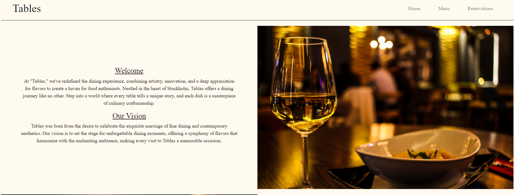
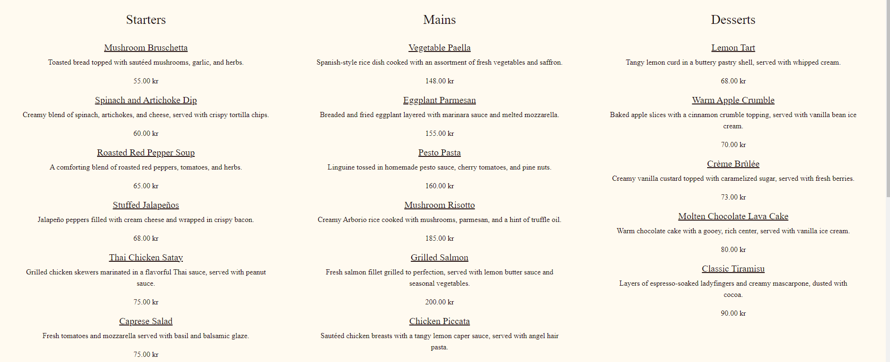
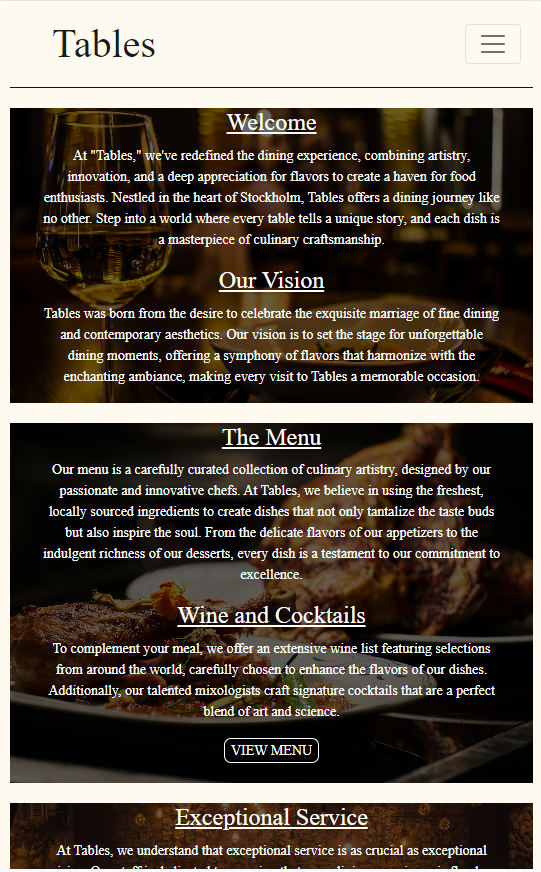

# Tables

Tables is a robust and user-friendly restaurant booking system designed to streamline the reservation process for both restaurant owner and customer. This web app provides an elegant solution for managing table reservations, enabling customers to book their preferred dining times and allowing restaurant staff to efficiently organize and confirm bookings.

# Features

## Home page

* The user is met by a warm homepage with ifromation about the restuarant and staff.
* The navigation bar helps users move seamlessly from page to page.

## Real-time Availability

* The system provides real-time availability updates, ensuring that customers recieve accurate information on table availability.

## Customizable Menus

* The restaurant can showcase and edit thier menus, including detailed descriptions and prices.

## User Profiles

* Diners can create and manage their profiles, making it easy to view and modify their reservations.

## Admin Dashboard

* Restaurant owner and staff have access to a powerful admin dashboard for managing reservations and updating menus.

## Responsive Design

* The application is designed to be fully responsive, providing a seamless booking experience on both desktop and mobile devices.

## Cloud integration

* Images and media assets are seamlessly integrated with Cloudinary, insuring efficient storage and retrieval of media content.

# Testing

* Automated python test were carried out for forms.py, models.py and views.py using Testcase.
* Tests can be found in respective test_forms.py, test_models.py and test_views.py.

* I have tested the web app manually both locally and after deployment
  
#### List of manual tests carried out that revealed app works as intended

* User registration - Verified that users can successfully create new accounts with valid information by creating multiple users.
* Login - Confirmed that created users can login by using those credentials to login.
* Booking creation - Successfully created multiple bookings(only when logged in) that were then displayed in booking.html.
* Booking confirmation - Once a booking was made i recieved an alert message telling me the booking was successful.
* Booking Modification - Apon creating a booking, a was able to edit both time, date and number of guests(only when logged in).
* Cancellation - In addition to editing i was able to delete any bookings(only when logged in).
* Reservation Management - while logged in as an admin i could view, modify and cancel any bookings.
* Menu Display - I tested adding and removing meal objects as an admin and respectively those meal were added/rmoved and displayed as such in the menu.html.
* Mobile Compatibility - Tested the app's responsiveness on various devices (desktop, tablet, and smartphone) to ensure a consistent user experience.
* 

## Validator Testing

* HTML
  * No errors were returned when passing through the official [W3C Validator](https://validator.w3.org/#validate_by_input)

* Css
  * No errors were returned when passing through the official [(Jigsaw) Validator](https://jigsaw.w3.org/css-validator/#validate_by_input)

* Javascript
  * No errors were returned when passing through the [(JShint) Validator](https://jshint.com/), just a few warnings.

# Planning

## User Stories

  
## Design

# Deployment

Live link - 

# Credits

## Content

 

## Media

